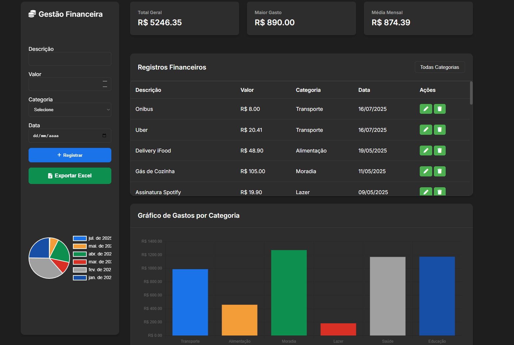

# 💸 Gasto Fácil - Gestor de Gastos Pessoais

O **Gasto Fácil** é um sistema completo de controle financeiro pessoal. Ele permite o cadastro, visualização, filtragem, exportação e análise de despesas, tudo de forma simples, intuitiva e visual.

> 📊 Perfeito para quem quer manter as finanças organizadas com praticidade e clareza.

---

## 🧭 Funcionalidades Principais

- ✅ Cadastro de despesas com descrição, valor, categoria e data  
- ✅ Visualização de todas as despesas em tabela filtrável  
- ✅ Cálculo de **total geral**, **maior gasto** e **média mensal**  
- ✅ Gráficos interativos mensais por categoria (`Chart.js`)  
- ✅ Exportação para Excel dos gastos registrados  
- ✅ Interface moderna e responsiva com HTML, CSS e JavaScript  
- ✅ API REST com Java + Spring Boot  
- ✅ Banco de dados em memória H2 (pode ser alterado facilmente para MySQL/PostgreSQL)

---

## 📦 Tecnologias Utilizadas

| Tecnologia          | Função                                      |
|---------------------|---------------------------------------------|
| Java + Spring Boot  | Back-end e API REST                         |
| H2 Database         | Persistência de dados em memória (para testes) |
| HTML + CSS          | Estrutura e estilo da interface             |
| JavaScript          | Interatividade e lógica do front-end        |
| Chart.js            | Gráficos de gastos por categoria e por mês  |
| SheetJS (XLSX)      | Exportação dos dados para planilhas Excel   |

---

## Funcionalidades e atualizações

📤 Exportação para Excel
Clique em "Exportar Excel" na interface para baixar uma planilha .xlsx com todos os dados salvos no banco de dados.

📈 Gráficos e Relatórios
O sistema exibe:

📆 Gastos por mês (gráfico de barras)

🏷️ Total por categoria (gráfico de pizza)

📊 Média mensal, maior gasto e total geral

🛣️ Próximas Atualizações
🔐 Sistema de login com autenticação por usuário

☁️ Persistência com banco de dados real (MySQL/PostgreSQL)

📎 Upload de comprovantes financeiros (PDF/Imagem)

### Atenção!!!
Esse projeto ainda esta sendo desenvolvido , é OpenSource então esta sujeito a muitas mudanças , por enquanto o projeto esta configurado com configuraçoes de teste como a classe dataLoader que carrega os dados para a aplicação com fim de mostrar o rumo deste projeto . Logo mais este projeto simples tera mais atualizaçoes

Dev - Rafael

## ⚙️ Como Instalar o Projeto Localmente

### Pré-requisitos:

- [Java JDK 17+](https://www.oracle.com/java/technologies/javase-downloads.html)
- [Node.js (opcional, se quiser rodar servidores adicionais)](https://nodejs.org)
- [Git](https://git-scm.com/)
- [Maven](https://maven.apache.org/)

